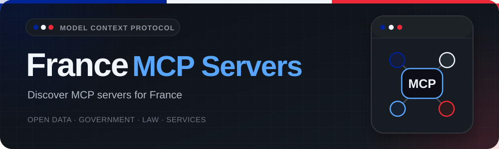

# France MCP Servers 🇫🇷

<p align="center">
  
</p>

> A curated catalog of [Model Context Protocol](https://modelcontextprotocol.io/)
> servers for French data, laws and services. Written entirely in English.

<p align="center">
<!-- BEGIN:badges -->
  <a href="https://github.com/bsab/france-mcp-servers/actions/workflows/ci.yml"></a>
  <a href="https://github.com/bsab/france-mcp-servers/actions/workflows/link-check.yml"></a>
  <a href="https://github.com/bsab/france-mcp-servers/actions/workflows/pages.yml"></a>
  <a href="LICENSE"></a>
  
  
<!-- END:badges -->
</p>

[Explore the catalog](https://bsab.github.io/france-mcp-servers/) ·
[Browse the JSON API](https://bsab.github.io/france-mcp-servers/catalog.json) ·
[Suggest a server](https://github.com/bsab/france-mcp-servers/issues/new?template=new-server.yml) ·
[Contribute](CONTRIBUTING.md)

## About this repository

The **Model Context Protocol (MCP)** lets AI assistants such as GitHub Copilot,
Claude and Cursor connect to external data sources and tools through a standard interface.

This repository is **not an MCP server itself**. It is an independent, public
catalog of MCP projects relevant to France, including open data, legislation,
government services and transport. It is not affiliated with or endorsed by the
French government or the listed projects.

The infrastructure is adapted from [Italia MCP Servers](https://github.com/bsab/italia-mcp-servers)
under its original [MIT license](LICENSE). This is a separate repository, not a fork;
it does not carry the Italian catalog or its Git history.

## Start here

| To… | Visit… |
|-----|--------|
| Browse by category | [Web catalog](https://bsab.github.io/france-mcp-servers/) |
| Integrate the catalog into an application | [JSON API](https://bsab.github.io/france-mcp-servers/catalog.json) |
| Suggest a missing project | [New server form](https://github.com/bsab/france-mcp-servers/issues/new?template=new-server.yml) |
| Correct outdated information | [Report an issue](https://github.com/bsab/france-mcp-servers/issues/new?template=report.yml) |
| Add a server directly | [Contribution guide](CONTRIBUTING.md) |

### Choosing and using a server

1. Choose a category and open a project's documentation.
2. Check its requirements, license, credentials and available MCP tools.
3. If a **remote endpoint** is listed, connect with a client supporting the stated transport.
4. Otherwise, follow the project's installation instructions and add its launch
   command to your MCP client's configuration.

> Configuration varies between clients and servers. This catalog links to sources;
> the project's own documentation remains the authority for setup and usage.
> A remote link opens an endpoint, not a one-click installation or a health check.

## Catalog

The **🎯 Ready score /100** measures documented readiness, not popularity or runtime
reliability. Where assessed, click the score for criteria, notes, sources and review date.
**Unassessed** does not mean zero. Entries are sorted by descending score, then by
name, with unassessed entries last. Bold names indicate an independent editorial selection.
[Assessment method and limitations](#quality-and-transparency).

Catalog entries have been checked against public repositories and documentation;
none has been assigned a Ready score. `last_verified` records that metadata check,
not a runtime test. No third-party MCP server or tool was executed.

<!-- BEGIN:catalog -->
### 📊 Data and Statistics

<table width="100%">
  <thead>
    <tr>
      <th width="23%">Project</th>
      <th width="13%" align="right">🎯 Ready score /100</th>
      <th width="6%" align="right">⭐</th>
      <th width="8%">Lang</th>
      <th width="40%">Description</th>
      <th width="10%">Link</th>
    </tr>
  </thead>
  <tbody>
  <tr>
    <td><a href="https://github.com/datagouv/datagouv-mcp">data.gouv.fr MCP</a></td>
    <td align="right"><a href="servers/datagouv-mcp.json" title="Documentation review: 2026-09-07; criteria and sources">100/100</a></td>
    <td align="right">1589</td>
    <td>Python</td>
    <td>Official data.gouv.fr MCP server for discovering French datasets, querying tabular resources, and exploring public API metadata.</td>
    <td align="center"><a href="https://mcp.data.gouv.fr/mcp" target="_blank" rel="noopener noreferrer" title="Open MCP endpoint: data.gouv.fr MCP"><kbd>Connect</kbd></a></td>
  </tr>
  <tr>
    <td><a href="https://github.com/cturkieh/france-data-mcp">france-data-mcp</a></td>
    <td align="right"><a href="servers/france-data-mcp.json" title="Documentation review: 2026-09-07; criteria and sources">100/100</a></td>
    <td align="right">3</td>
    <td>TS</td>
    <td>Cross-reference 13 French public datasets covering healthcare, demographics, businesses, geography, planning, and real estate.</td>
    <td align="center"><a href="https://france-data-mcp.vercel.app/mcp" target="_blank" rel="noopener noreferrer" title="Open MCP endpoint: france-data-mcp"><kbd>Connect</kbd></a></td>
  </tr>
  <tr>
    <td><a href="https://github.com/DavidScanu/mcp-insee-entreprises">INSEE Entreprises MCP</a></td>
    <td align="right"><a href="servers/insee-entreprises.json" title="Documentation review: 2026-09-07; criteria and sources">100/100</a></td>
    <td align="right">1</td>
    <td>Python</td>
    <td>Look up French businesses by SIREN or SIRET and search by location or activity using INSEE Sirene and the public business-search API.</td>
    <td align="center">—</td>
  </tr>
  <tr>
    <td><a href="https://github.com/stefanoamorelli/pappers-mcp">Pappers MCP</a></td>
    <td align="right"><a href="servers/pappers-mcp.json" title="Documentation review: 2026-09-07; criteria and sources">85/100</a></td>
    <td align="right">1</td>
    <td>Go</td>
    <td>Query French company legal data, financials, directors, beneficial owners, documents, compliance, and surveillance through Pappers API v2.</td>
    <td align="center">—</td>
  </tr>
  <tr>
    <td><a href="https://github.com/InseeFrLab/McpDiffusion">McpDiffusion</a></td>
    <td align="right"><a href="servers/mcpdiffusion.json" title="Documentation review: 2026-09-07; criteria and sources">75/100</a></td>
    <td align="right">1</td>
    <td>Python</td>
    <td>Beta server unifying INSEE publications, MELODI datasets, and RMES semantic metadata behind a remote MCP endpoint.</td>
    <td align="center"><a href="https://mcpdiffusion.lab.sspcloud.fr/mcp" target="_blank" rel="noopener noreferrer" title="Open MCP endpoint: McpDiffusion"><kbd>Connect</kbd></a></td>
  </tr>
  <tr>
    <td><a href="https://github.com/thomas-servais/mcp-recherche-entreprise">Recherche d&#x27;Entreprises MCP</a></td>
    <td align="right"><a href="servers/recherche-entreprise.json" title="Documentation review: 2026-09-07; criteria and sources">57.5/100</a></td>
    <td align="right">1</td>
    <td>TS</td>
    <td>Search French companies and associations by name, location, activity, and certification using the government&#x27;s public business-search API.</td>
    <td align="center">—</td>
  </tr>
  <tr>
    <td><a href="https://pillr.fr/mcp">Pillr</a></td>
    <td align="right">Unassessed</td>
    <td align="right">0</td>
    <td>TS</td>
    <td>French property data: price per m² by municipality, local market summary and planning permit requirements.</td>
    <td align="center"><a href="https://pillr.fr/api/mcp" target="_blank" rel="noopener noreferrer" title="Open MCP endpoint: Pillr"><kbd>Connect</kbd></a></td>
  </tr>
  </tbody>
</table>

### 🗺️ Geospatial and Territory

<table width="100%">
  <thead>
    <tr>
      <th width="23%">Project</th>
      <th width="13%" align="right">🎯 Ready score /100</th>
      <th width="6%" align="right">⭐</th>
      <th width="8%">Lang</th>
      <th width="40%">Description</th>
      <th width="10%">Link</th>
    </tr>
  </thead>
  <tbody>
  <tr>
    <td><a href="https://github.com/ignfab/geocontext">Geocontext</a></td>
    <td align="right"><a href="servers/geocontext.json" title="Documentation review: 2026-09-07; criteria and sources">100/100</a></td>
    <td align="right">26</td>
    <td>TS</td>
    <td>IGNfab prototype for querying authoritative French geospatial data, including geocoding, elevation, cadastre, and urban planning.</td>
    <td align="center"><a href="https://geollm.beta.ign.fr/geocontext/mcp" target="_blank" rel="noopener noreferrer" title="Open MCP endpoint: Geocontext"><kbd>Connect</kbd></a></td>
  </tr>
  <tr>
    <td><a href="https://github.com/julienkalamon/ign-apicarto-mcp-server">IGN API Carto MCP</a></td>
    <td align="right"><a href="servers/ign-apicarto-mcp-server.json" title="Documentation review: 2026-09-07; criteria and sources">85/100</a></td>
    <td align="right">11</td>
    <td>TS</td>
    <td>Query IGN API Carto for French cadastre, administrative boundaries, agriculture, protected areas, urban planning, appellations, and WFS data.</td>
    <td align="center">—</td>
  </tr>
  </tbody>
</table>

### ⚖️ Legal Tech and Law

<table width="100%">
  <thead>
    <tr>
      <th width="23%">Project</th>
      <th width="13%" align="right">🎯 Ready score /100</th>
      <th width="6%" align="right">⭐</th>
      <th width="8%">Lang</th>
      <th width="40%">Description</th>
      <th width="10%">Link</th>
    </tr>
  </thead>
  <tbody>
  <tr>
    <td><a href="https://github.com/guix77/mcp-inpi-pi">INPI Industrial Property MCP</a></td>
    <td align="right"><a href="servers/mcp-inpi-pi.json" title="Documentation review: 2026-09-07; criteria and sources">100/100</a></td>
    <td align="right">0</td>
    <td>TS</td>
    <td>Search French, European, and international trademarks through the INPI Industrial Property API, including trademark details and Nice classes.</td>
    <td align="center">—</td>
  </tr>
  <tr>
    <td><a href="https://github.com/Ktulu-Analog/mcp-legifrance">Légifrance MCP</a></td>
    <td align="right"><a href="servers/ktulu-legifrance.json" title="Documentation review: 2026-09-07; criteria and sources">90/100</a></td>
    <td align="right">3</td>
    <td>Python</td>
    <td>Community MCP server for French legislation, legal codes, the Official Journal, collective agreements, and case law through Légifrance.</td>
    <td align="center">—</td>
  </tr>
  <tr>
    <td><a href="https://github.com/Ktulu-Analog/mcp-judilibre">Judilibre MCP</a></td>
    <td align="right"><a href="servers/ktulu-judilibre.json" title="Documentation review: 2026-09-07; criteria and sources">87.5/100</a></td>
    <td align="right">2</td>
    <td>Python</td>
    <td>Community MCP server for searching, reading, and exporting French court decisions from the Cour de cassation&#x27;s Judilibre API.</td>
    <td align="center">—</td>
  </tr>
  </tbody>
</table>

### 🏛️ Government and Public Finance

<table width="100%">
  <thead>
    <tr>
      <th width="23%">Project</th>
      <th width="13%" align="right">🎯 Ready score /100</th>
      <th width="6%" align="right">⭐</th>
      <th width="8%">Lang</th>
      <th width="40%">Description</th>
      <th width="10%">Link</th>
    </tr>
  </thead>
  <tbody>
  <tr>
    <td><a href="https://github.com/ironlam/poligraph-mcp">Poligraph MCP</a></td>
    <td align="right"><a href="servers/poligraph-mcp.json" title="Documentation review: 2026-09-07; criteria and sources">85/100</a></td>
    <td align="right">0</td>
    <td>TS</td>
    <td>Query documented French political data about politicians, mandates, parliamentary votes, parties, elections, public affairs, and fact-checks.</td>
    <td align="center"><a href="https://mcp.poligraph.fr/mcp" target="_blank" rel="noopener noreferrer" title="Open MCP endpoint: Poligraph MCP"><kbd>Connect</kbd></a></td>
  </tr>
  <tr>
    <td><a href="https://github.com/pipeworx-io/mcp-data-economie-fr">Data Économie France MCP</a></td>
    <td align="right"><a href="servers/mcp-data-economie-fr.json" title="Documentation review: 2026-09-07; criteria and sources">80/100</a></td>
    <td align="right">0</td>
    <td>TS</td>
    <td>Search, inspect, and query data.economie.gouv.fr datasets covering French public finance, taxation, procurement, companies, and economic indicators.</td>
    <td align="center"><a href="https://gateway.pipeworx.io/data-economie-fr/mcp" target="_blank" rel="noopener noreferrer" title="Open MCP endpoint: Data Économie France MCP"><kbd>Connect</kbd></a></td>
  </tr>
  </tbody>
</table>

### 🧭 Public Services

<table width="100%">
  <thead>
    <tr>
      <th width="23%">Project</th>
      <th width="13%" align="right">🎯 Ready score /100</th>
      <th width="6%" align="right">⭐</th>
      <th width="8%">Lang</th>
      <th width="40%">Description</th>
      <th width="10%">Link</th>
    </tr>
  </thead>
  <tbody>
  <tr>
    <td><a href="https://github.com/guigui42/mcp-vosdroits">VosDroits MCP</a></td>
    <td align="right"><a href="servers/mcp-vosdroits.json" title="Documentation review: 2026-09-07; criteria and sources">80/100</a></td>
    <td align="right">105</td>
    <td>Go</td>
    <td>Search and retrieve French administrative procedures and tax guidance published on service-public.gouv.fr and impots.gouv.fr.</td>
    <td align="center">—</td>
  </tr>
  </tbody>
</table>

### 💼 Employment and Labor

<table width="100%">
  <thead>
    <tr>
      <th width="23%">Project</th>
      <th width="13%" align="right">🎯 Ready score /100</th>
      <th width="6%" align="right">⭐</th>
      <th width="8%">Lang</th>
      <th width="40%">Description</th>
      <th width="10%">Link</th>
    </tr>
  </thead>
  <tbody>
  <tr>
    <td><a href="https://github.com/JoJoLaBagarre/france-travail-mcp">France Travail MCP</a></td>
    <td align="right"><a href="servers/france-travail-mcp.json" title="Documentation review: 2026-09-07; criteria and sources">100/100</a></td>
    <td align="right">1</td>
    <td>TS</td>
    <td>Search official France Travail job listings, explore ROME occupations, predict ROME codes, and identify companies likely to recruit.</td>
    <td align="center">—</td>
  </tr>
  </tbody>
</table>

### 🚆 Transport and Mobility

<table width="100%">
  <thead>
    <tr>
      <th width="23%">Project</th>
      <th width="13%" align="right">🎯 Ready score /100</th>
      <th width="6%" align="right">⭐</th>
      <th width="8%">Lang</th>
      <th width="40%">Description</th>
      <th width="10%">Link</th>
    </tr>
  </thead>
  <tbody>
  <tr>
    <td><a href="https://github.com/krezzoid/sncf-mcp">sncf-mcp</a></td>
    <td align="right"><a href="servers/sncf-mcp.json" title="Documentation review: 2026-09-07; criteria and sources">90/100</a></td>
    <td align="right">5</td>
    <td>Go</td>
    <td>Plan journeys and query stations, upcoming departures, and service disruptions through the official SNCF and Navitia open-data API.</td>
    <td align="center">—</td>
  </tr>
  </tbody>
</table>
<!-- END:catalog -->

### Verification notes

The initial five listings were checked on **2026-09-06** and the six additions on
**2026-09-07**. Each metadata file links its consulted README at a fixed commit.
Licenses reflect upstream declarations; star counts are GitHub snapshots, not
recommendations. Installation requirements below come from documentation and source
inspection, not execution.

### Runtime smoke tests

Community reports are point-in-time observations, not endorsements, certifications or
uptime guarantees. On **2026-09-08**, [xhmq3131 reported](https://github.com/bsab/france-mcp-servers/issues/10#issuecomment-5581671607)
that data.gouv.fr MCP worked without authentication using mcporter 0.13.7 on Windows 11
(build 22631) over Streamable HTTP. The endpoint initialized, exposed its tool schemas
and returned three results from `search_datasets` for `emploi`. A direct MCP protocol
check independently confirmed those endpoint behaviors on the same date.

To reproduce the reported smoke test (requires Node.js 24 or newer):

```bash
npx --yes mcporter@0.13.7 list https://mcp.data.gouv.fr/mcp --schema
npx --yes mcporter@0.13.7 call https://mcp.data.gouv.fr/mcp.search_datasets \
  query=emploi page_size=3 --output json
```

Results may change as the catalog data and hosted service evolve. No API key is
required for these commands.

| Project | Setup and important qualifications |
|---------|------------------------------------|
| [data.gouv.fr MCP](servers/datagouv-mcp.json) | Official server; its documented public endpoint uses Streamable HTTP without access restrictions. Direct stdio and SSE are not supported. Self-hosting instructions are also available. |
| [Légifrance MCP](servers/ktulu-legifrance.json) | Community Python server, self-hosted over Streamable HTTP. Requires a PISTE Légifrance subscription and `LEGIFRANCE_CLIENT_ID` / `LEGIFRANCE_CLIENT_SECRET`. No public hosting is claimed. |
| [Judilibre MCP](servers/ktulu-judilibre.json) | Community Python server, self-hosted over Streamable HTTP. Requires a PISTE Judilibre subscription and `JUDILIBRE_CLIENT_ID` / `JUDILIBRE_CLIENT_SECRET`. No public hosting is claimed. |
| [INSEE Entreprises MCP](servers/insee-entreprises.json) | Source installation with Python 3.12+ and `uv`; stdio. `INSEE_API_KEY` is needed for SIREN/SIRET lookups, but not advanced business search. MIT is declared by a README badge; no standalone license text was found. The source targets Sirene 3.11; current API compatibility is not verified. |
| [Recherche d'Entreprises MCP](servers/recherche-entreprise.json) | Source installation with Node.js 18+, `npm install` and `npm run build`; stdio. Its public business-search requests do not use credentials. ISC is declared in package metadata. The README contains a placeholder clone URL: use the canonical repository link. |
| [McpDiffusion](servers/mcpdiffusion.json) | Beta project, not an official supported INSEE product. A public HTTP endpoint is documented; most self-hosted tools require a private Elasticsearch index, while only the RMES SPARQL tool works without it. |
| [Geocontext](servers/geocontext.json) | IGNfab incubation prototype with remote HTTP and local stdio options. The project explicitly states that it is not yet an industrialized IGN product. |
| [VosDroits MCP](servers/mcp-vosdroits.json) | Community Go server distributed as binaries and a Docker image over stdio. It retrieves official Service-Public and tax content through web scraping rather than official APIs. |
| [france-data-mcp](servers/france-data-mcp.json) | Offers a hosted Streamable HTTP endpoint and an npm stdio wrapper for 13 public sources and 36 tools. The public endpoint documents a per-IP rate limit. |
| [France Travail MCP](servers/france-travail-mcp.json) | Local stdio server requiring free France Travail application credentials and subscriptions to the APIs used. La Bonne Boîte needs separate approval and is disabled by default. |
| [sncf-mcp](servers/sncf-mcp.json) | Local Go server using stdio by default and requiring a free SNCF/Navitia API key. It covers journey planning and operational information, not ticket prices. |

The two PISTE servers mention sandbox setup in their READMEs but use production
API URLs in source; sandbox compatibility is not verified. Recherche d'Entreprises
also documents rate-limit and timeout settings that are not applied to its upstream
request. Review these limitations before use. Inclusion does not certify upstream
availability, licensing completeness or client compatibility.

## Data and API

The machine-readable catalog is regenerated on updates to `main` by the Pages workflow.
Public URLs below become available once the repository maintainer enables GitHub Pages
with GitHub Actions and the first deployment succeeds.

```bash
curl -s https://bsab.github.io/france-mcp-servers/catalog.json \
  | jq '.servers[] | {name, category, url}'
```

| Resource | URL |
|----------|-----|
| Catalog | <https://bsab.github.io/france-mcp-servers/catalog.json> |
| Catalog schema | <https://bsab.github.io/france-mcp-servers/schema/catalog.schema.json> |
| Server schema | <https://bsab.github.io/france-mcp-servers/schema/server.schema.json> |
| Search and filters | <https://bsab.github.io/france-mcp-servers/> |

`version` identifies the document structure and changes only for incompatible updates.
Each `servers` entry contains the source JSON fields plus `url`, the canonical project
link, and `readiness_score`, the derived static score or `null` if unassessed.
Optional `quality` records review evidence and dates; `quality_rubric` describes
how scores are calculated. French catalog category identifiers are English slugs.

## Quality and transparency

Inclusion **does not certify or endorse** a project. Before use, review its code,
requested permissions, data handling and license.

To be included, a server must:

- implement the **Model Context Protocol**, not merely offer an API;
- be relevant to French data, laws or services;
- provide at least one public repository, documentation site or MCP endpoint;
- have sufficient usage documentation.

### 🎯 Ready score

The **Ready score** measures documented readiness from 0 to 100.
Static rubric v1 evaluates evidence in public documentation:

| Criterion | Weight |
|-----------|-------:|
| Concrete installation or connection steps | 30 |
| Explicit configuration, credentials and prerequisites | 20 |
| Documented MCP tools and capabilities, with examples | 20 |
| Declared transport and compatible clients | 15 |
| Explicit license with accessible terms | 10 |
| Documented known limitations | 5 |

Each criterion earns zero if not documented in the consulted sources, half its weight
if partial, or its full weight if complete. The score is their sum.
**Unassessed** means no assessment is available or sources could not be consulted;
it is not zero. Notes and sources, preferably pinned to commits, are public and
can be corrected through pull requests. Review dates refer to documentation checks.
The starter catalog was researched with AI assistance; its entries are unassessed
and open to source-based corrections.

No servers or MCP tools are executed for this review. The score **does not certify
functionality, security, availability or active maintenance**. Well-documented servers
may still fail. Weights are an editorial choice, not an experimentally validated
benchmark. Assessment is not a prerequisite for inclusion.

[Full checklist and assessment contribution guide](CONTRIBUTING.md#static-documentation-assessment).

GitHub stars are informational snapshots, not live counts. Stars, `featured`, remote
access and recent activity do not contribute to scores. CI validates the data structure;
external links are checked weekly, separately from documentation assessments.

## Contributing

The simplest way to help is to
[suggest a server](https://github.com/bsab/france-mcp-servers/issues/new?template=new-server.yml).
To add one directly:

1. Create a `kebab-case.json` file in `servers/`.
2. Follow [`schema/server.schema.json`](schema/server.schema.json).
3. Validate the entry and regenerate the README.
4. Open a pull request.

```bash
python3 -m venv .venv
.venv/bin/python -m pip install -r scripts/requirements.txt
.venv/bin/python scripts/validate_servers.py
.venv/bin/python scripts/build_readme.py
.venv/bin/python scripts/build_readme.py --check
.venv/bin/python -m unittest discover -s scripts -p 'test_*.py'
.venv/bin/python scripts/build_catalog.py
```

README tables and badges inside `BEGIN`/`END` markers are generated; do not edit them
by hand. See [CONTRIBUTING.md](CONTRIBUTING.md) for fields, categories, validation,
local preview and deployment instructions.

## License and attribution

This catalog is distributed under the [MIT license](LICENSE), preserving the original
copyright from [Italia MCP Servers](https://github.com/bsab/italia-mcp-servers).
The listed servers remain subject to their own licenses.

---

<p align="center">
  <i>Making French data, laws and services easier to discover for AI assistants.</i>
</p>
</p>